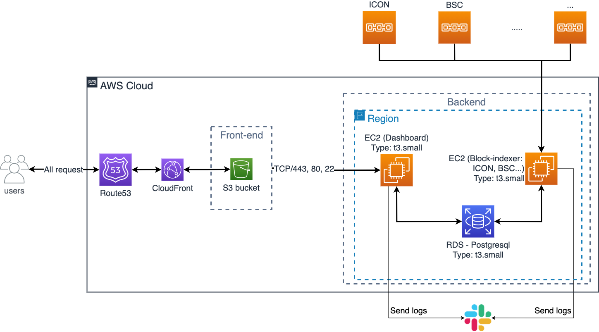

Follow this guideline to create database and start server in `block-indexer` and `dashboard-api`.
## 1. Go to `dashboard-api` folder

Execute this command to create database:

```bash
node ./db-init/index.js`
```

Execute this command to start server:

```bash
yarn start
```


## 2. Go to `block-indexer` folder

Execute this command to create database (create registered_tokens):

```bash
node ./db-init/index.js
```

Execute this command to start block-indexers:
```bash
icon: `yarn start:icon`

moonbeam: `yarn start:moonbeam`

bsc: `yarn start:bsc`

near: `yarn start:near`

harmony: `yarn start:harmony`
```

In a EC2 instance, configure cron job to update relayer candidate rewards.
```bash
$ crontab -e

# add this script and save changes.
# ref: https://crontab.guru/
0 0 * * * /home/ubuntu/apps/btp-dashboard/packages/block-indexer/scripts/reward_reader.sh

$ crontab -l
```

## 3. Architecture
